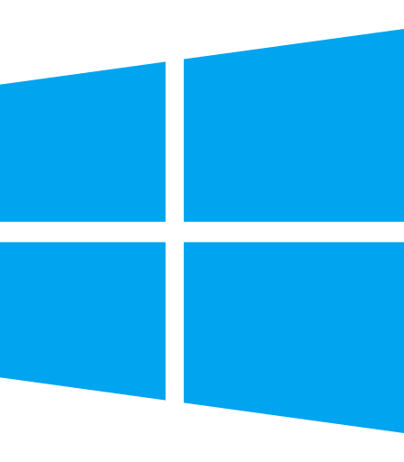

# Rebellion 2

Download and install **Rebellion 2** for Windows or macOS.

## Download

<table>
  <tr>
    <td align="center" width="50%">
      <a href="https://github.com/adasgames/rebellion2-installers/releases/latest/download/Rebellion2-Windows-Setup.exe">
         
        <strong>Install latest for Windows</strong>
      </a> 
      64-bit Windows installer
    </td>
    <td align="center" width="50%">
      <a href="https://github.com/adasgames/rebellion2-installers/releases/download/latest-macos/Rebellion2-macOS.zip">
         
        <strong>Download latest for macOS</strong>
      </a> 
      Universal Intel + Apple Silicon app
    </td>
  </tr>
</table>

[View release notes and all assets](https://github.com/adasgames/rebellion2-installers/releases/latest).

The launcher verifies ownership automatically before downloading game content. You must own
either *Star Wars: Rebellion* or *Star Wars: Empire at War: Gold Pack* on **GOG** or **Steam**.

## FAQ

### Why is Empire at War accepted?

*Star Wars: Rebellion* is no longer available for purchase through its former digital storefronts,
leaving new players without the original—and preferred—ownership path. To keep Rebellion II
accessible while still requiring ownership of a commercially available Star Wars strategy game,
the installer also accepts *Star Wars: Empire at War: Gold Pack*.

This is only an alternative ownership check. Rebellion II does not copy, extract, install, or
otherwise use any files, code, artwork, audio, or other assets from *Empire at War*. Existing
owners can continue verifying *Rebellion*; players who can no longer purchase it may instead
verify ownership of *Empire at War: Gold Pack*.

## Install

### Windows
1. Run **`Rebellion2-Windows-Setup.exe`**.
2. Windows may show a blue **"Windows protected your PC"** box. Click **More info → Run anyway**.
3. Follow the installer. Rebellion 2 lands in your Start Menu.

### macOS
1. Unzip **`Rebellion2-macOS.zip`**.
2. Drag **`Rebellion2.app`** into your **Applications** folder. The launcher and game are both
   contained in that single app.
3. The first time, **right-click the app → Open**, then click **Open** in the dialog. (A normal
   double-click will be blocked — you only need the right-click trick once.)

## Heads up

These builds are **not yet code-signed**, which is why Windows and macOS show the warnings
above — they're expected and safe to dismiss. Signing is on the roadmap.

## License

Original software authored for this project is available under the
[PolyForm Noncommercial License 1.0.0](LICENSE.md). It may be used, modified, and redistributed for
permitted noncommercial purposes. The license does not grant rights to third-party software,
trademarks, names, artwork, audio, game data, or other materials.

---

*Building the installers yourself or maintaining the release pipeline? See [`docs/BUILD.md`](docs/BUILD.md).*
